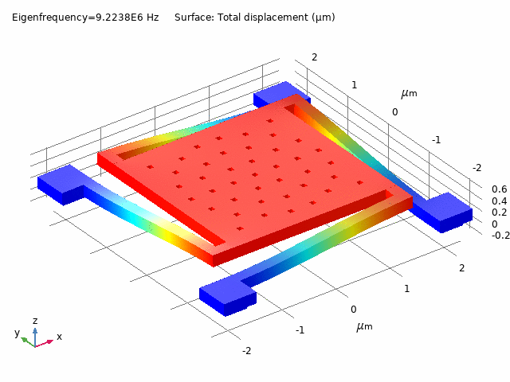

# Stanford Accelerate NEM Relay Models

This repository contains almost everything a researcher would need to get started with NEM relays (or MEM relays): (1) a parametric layout generator with KLayout, (2) finite elment models (FEM) with COMSOL/ANSYS, (3) static/dynamic compact model generators with Mathematica/SPICE, (4) scripts for characterization with Synopsys SiliconSmart.

A video tutorial of the COMSOL model is available: https://www.youtube.com/watch?v=YCjhU6pspo0

## Configure NEM relay parameters

The configuration file `params.json` controls the parameters for all models.

## KLayout NEM relay layout generator

Please use `pip install klayout` to install the Python API for KLayout. You can also install the KLayout GUI (https://www.klayout.de/), which may help with layout visualization.

Running `cd layouts; python relay.py` will generate layouts based on the parameters in `params.json`.

## Finite element modeling (FEM)

### COMSOL model

The COMSOL model has 5 studies that predict the physics of the multi-pole NEM relay. These are:
1. Spring Constant: determine spring constant by applying force to plate
2. Modal Analysis: determine eigenmodes and shapes
3. Parasitic Extraction: extract parasitic mutual capacitances between all terminals
4. Quasi-Static Sweep: find pull-in and pull-out voltages, contact forces, displacement contour, etc.
5. Transient Sweep: find out pull-in speed

TODO: instructions on how to load parameter settings and modify things.

### ANSYS model (unfinished)

There is an ANSYS 2020 model which builds the NEM relay geometry using SpaceClaim. More work is needed for parasitic extraction, parameter sweeping, etc. to work.

## Compact modeling

### SPICE/Verilog-A model

This model is adapted from "Micro-Relay Technology For Energy-Efficient Integrated Circuit" (Hei Kam, Fred Chen) and is designed for use with SPECTRE or HSPICE. Has been tested with HSPICE 2017.03. May also work with other SPICE simulators.

TODO

### Mathematica model

Running the Mathematica notebook will solve the damped ODE model of the NEM relay and yield the transient displacemnt curve. It is good for understanding the effect of Q-factor damping.

### Liberty model

TODO
