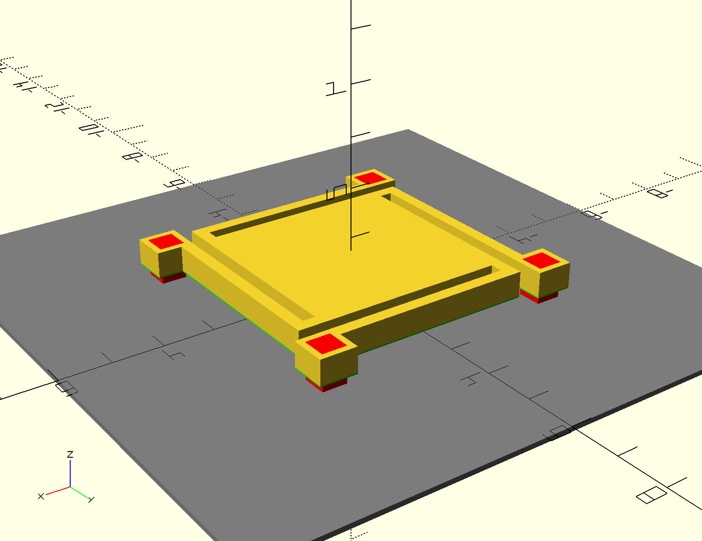
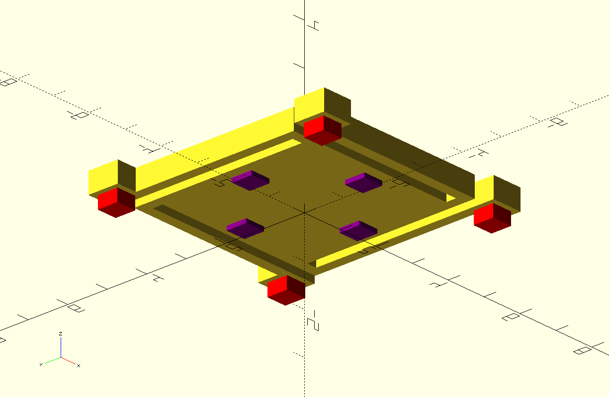

# NEM-Relay-CAD
Highly-parametrized OpenSCAD model of NEM relay for FEM, layout generation, and design space exploration

## Model usage instructions
- Install [OpenSCAD](https://www.openscad.org/)
- Open `relay.scad` in OpenSCAD
- Modify parameters according to your desired design specifications
- Compile and export as STL/DXF

## Hand calculation plotting instructions
- Run `gen_handcalcs.py` with Python

## FreeCAD instructions for finding spring constant
- Run `gen_stl.py` to export STLs programmatically
- Open exported STL files in FreeCAD
- Run script freecad/FEM-spring-const.FCMacro
- Run CalculiX and view results under CCX_Results

## Future CAD goals
- Add insulating layer to model for GDS layouts
- Add script for conversion to GDS layouts
- Add support for release holes in CAD model
- Add support for contact-to-via interconnect generation
- Add support for n-gon relay shapes with n cantilevers+vias
- Add support for cantilevers with multiple turns

## Near-term project goals
- Hand analysis of models with different parameters
- FEM of models with different parameters
- Approximate SPICE model generation from OpenSCAD model
- Analysis of relay for RF MEMS and PLD applications

## Future project goals
- Model squeeze film damping
- FEM SPICE model generation from OpenSCAD model
